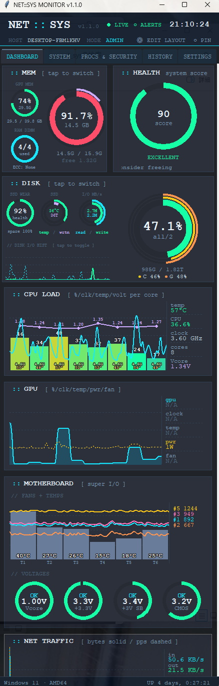

# NET::SYS MONITOR

A sleek, single-window Windows 11 system monitoring dashboard built with Python and Tkinter. Real-time CPU, memory, GPU, disk, motherboard sensors, and network traffic — all in one customizable 440px-wide window.



---

## Features

- **Real-time monitoring** (1-second update interval) for:
  - **CPU**: per-core load, temperature, clock, voltage
  - **Memory**: RAM usage, GPU VRAM, DIMM slot occupancy
  - **GPU**: usage, temperature, power, fan, clock (NVIDIA / Intel iGPU / AMD via LHM)
  - **Disk**: per-volume usage donut, SSD wear, SSD temperature, I/O rate
  - **Motherboard**: fan RPMs, SuperIO temperatures, voltages
  - **Network**: per-NIC traffic, IPv4/IPv6 packet stats, packets/sec
  - **Battery**: charge level, status, time remaining

- **Customizable dashboard**: drag-and-drop card layout (`EDIT LAYOUT` mode)
- **System health score**: weighted aggregation of CPU/MEM/temp/SSD/GPU into 0-100
- **Alert system**: configurable thresholds with persistent notifications
- **Historical data**: SQLite-backed metric history with retention policy
- **Themes**: multiple color presets + per-color customization
- **PIN-on-top mode**: always-visible monitoring overlay
- **Compact 440px-wide design**: fits beside any work window

## Screenshots

### Dashboard (main view)


### System info tab


### Edit layout mode


---

## Requirements

- **OS**: Windows 10 / 11 (some features Windows-only)
- **Python**: 3.9 or later
- **Dependencies**:
  - `psutil` (auto-installed on first run)
  - **[LibreHardwareMonitor](https://github.com/LibreHardwareMonitor/LibreHardwareMonitor)** running with its built-in HTTP server enabled on port 8085 (for CPU/GPU/motherboard temperatures and voltages)

### Optional
- `nvidia-smi` (for detailed NVIDIA GPU stats)
- `smartctl` (for SSD wear/written stats)
- Administrator privileges (for full per-process network statistics)

---

## Installation

```cmd
git clone https://github.com/chichirou/net-sys.git
cd net-sys
python net_sys.py
```

On first launch, `psutil` will be auto-installed via pip if missing.

### Setting up LibreHardwareMonitor

1. Download from [LibreHardwareMonitor releases](https://github.com/LibreHardwareMonitor/LibreHardwareMonitor/releases)
2. Run as administrator
3. **Options → Remote Web Server → Run**
4. **Options → Remote Web Server → Port** = 8085

Without LHM, the app still works but CPU/GPU temperatures and voltages will show as `N/A`.

---

## Usage

### Basic
Just run `python net_sys.py`. The window opens at fixed width (440px) and auto-saves position/height to `~/.net_sys_config.json`.

### Edit Layout
Click `⚙ EDIT LAYOUT` in the header to enter drag mode:
- Drag cards to rearrange (left/right = side-by-side, top/bottom = new row, center = swap)
- Click `✓ DONE` to save

### NIC Selection
The NET TRAFFIC card has a dropdown to choose:
- **ALL** — system-wide aggregated traffic
- **IPv4 (pkts)** — IPv4 protocol packets only (Windows)
- **IPv6 (pkts)** — IPv6 protocol packets only (Windows)
- **Individual NICs** — per-interface traffic with IP info

### Alerts
Configure in `SETTINGS → Alerts`. Supports CPU/MEM/temp/disk thresholds with sound/popup notifications.

### Themes
`SETTINGS → Appearance` — choose from presets or customize colors.

---

## Architecture

| File | Purpose |
|---|---|
| `net_sys.py` | Main application + UI + data collector |
| `net_sys_layout.py` | Drag-and-drop dashboard layout manager |
| `net_sys_alerts.py` | Alert threshold evaluation + notifications |
| `net_sys_history.py` | SQLite-backed metric history |

### Data flow

```
Collector (1s loop)
   ↓
psutil + LHM HTTP + PowerShell (per-NIC, per-protocol)
   ↓
live() dict → _apply_live() (UI thread, every 1s)
   ↓
Cards re-render (donuts, line charts, gauges)
```

Heavy queries (disks, SSD SMART, GPU details) run every 5 seconds in parallel background threads via `_tick_heavy`.

---

## Known limitations

- **Per-process network statistics**: Windows requires admin privileges; non-admin shows `0`
- **GPU on AMD**: requires LHM; some AMD cards expose limited sensors
- **IPv4/IPv6 traffic**: Windows only provides packet counts, not byte counts (OS API limitation)
- **Disk donut rings**: max 5 volumes visible (additional ones still counted in totals)

---

## Contributing

This is a personal project, but PRs and issues are welcome. Especially:
- Linux/macOS support (the collector has Windows-specific PowerShell calls)
- Additional themes
- AMD GPU sensor improvements
- Bug fixes

Please open an issue first for large changes.

---

## License

MIT License — see [LICENSE](LICENSE) for full text.

Copyright (c) 2026 Shinichiro Naito (chichirou)

---

## Acknowledgments

- **[psutil](https://github.com/giampaolo/psutil)** — cross-platform system metrics
- **[LibreHardwareMonitor](https://github.com/LibreHardwareMonitor/LibreHardwareMonitor)** — sensor data via HTTP
- **Tkinter** — the venerable Python GUI toolkit, still going strong
